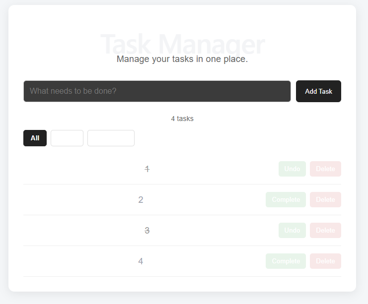

# Full-Stack Task Manager



A full-stack task management application built with React, Express, Node.js, and SQLite.

## Features

* Create tasks
* View tasks
* Complete and undo tasks
* Delete tasks
* Tasks persist in a SQLite database
* Filter tasks by All, Active, and Completed
* Loading states
* Error handling
* Responsive design
* REST API
* Frontend and backend communication

## Technologies

### Frontend

* React
* JavaScript
* CSS
* Vite

### Backend

* Node.js
* Express
* CORS

### Database

* SQLite
* better-sqlite3

## API Endpoints

| Method | Endpoint         | Description   |
| ------ | ---------------- | ------------- |
| GET    | `/api/tasks`     | Get all tasks |
| POST   | `/api/tasks`     | Create a task |
| PUT    | `/api/tasks/:id` | Update a task |
| DELETE | `/api/tasks/:id` | Delete a task |

## What I Learned

This project helped me practice:

* Building React applications
* React state with `useState`
* React effects with `useEffect`
* Components and event handling
* Fetching data from an API
* REST API design
* Express.js
* HTTP methods
* CORS
* SQLite databases
* SQL CRUD operations
* Async/await
* Error handling
* Connecting a frontend to a backend
* Responsive CSS
* Git and GitHub

## Getting Started

### 1. Install frontend dependencies

From the project root:

```bash
npm install
```

### 2. Start the React frontend

```bash
npm run dev
```

The frontend will run on:

```text
http://localhost:5173
```

### 3. Start the backend

Open a second terminal and navigate to the server directory:

```bash
cd server
```

Install the backend dependencies:

```bash
npm install
```

Start the Express server:

```bash
node server.js
```

The API will run on:

```text
http://localhost:5000
```

## Project Structure

```text
task-manager/
├── src/
│   ├── App.jsx
│   ├── App.css
│   └── main.jsx
├── server/
│   ├── server.js
│   └── database.js
├── package.json
└── README.md
```

## Author

Kiran Persaud
